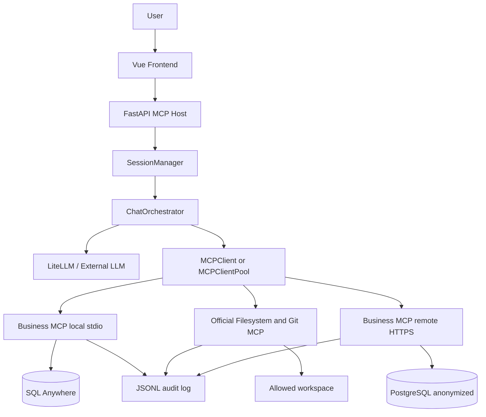

# Executive Insights

Executive Insights is an academic business analytics chatbot. It combines a
Vue interface, a FastAPI host, LiteLLM, and a manually implemented JSON-RPC 2.0
and Model Context Protocol (MCP) layer. The application answers controlled
business questions using sales data without allowing the language model to
submit arbitrary SQL.

## Features

- Natural-language sales analysis in Spanish or English.
- Local MCP server over newline-delimited stdio.
- Remote MCP server over HTTP.
- Optional integration of the official Filesystem and Git MCP servers into the
  same chatbot tool catalog.
- LiteLLM provider abstraction for switching LLM providers.
- SQL Anywhere 17 access for local development.
- PostgreSQL dataset for remote deployment.
- Stable anonymization of clients, products, brands, lines, countries, and invoices.
- Business tools for summaries, period comparisons, product performance, metrics, and customer product mix.
- JSON-RPC audit logging with secrets and full result sets excluded.
- Vue chat interface with Markdown responses and optional charts.
- Automated tests for JSON-RPC, MCP, data access, orchestration, API, sessions, and anonymization.

## Architecture

```text
Local:  Vue -> FastAPI -> LiteLLM -> MCP stdio -> SQL Anywhere
Remote: Client/API -> HTTP JSON-RPC -> MCP Docker -> PostgreSQL anonymized dataset
```

### Architecture diagram



The FastAPI application is the host exposed to the frontend. The orchestrator
uses the LLM to interpret the question and choose a tool. `MCPClient` provides
the common request interface, while `MCPClientPool` routes tools discovered
from multiple servers. The local business server accesses SQL Anywhere, the
remote server accesses PostgreSQL, and all MCP directions are recorded by the
audit logger.

## Requirements

- Python 3.12+ (Conda environment is recommended).
- Node.js 18+.
- For local mode: SQL Anywhere 17 and its 64-bit ODBC driver.
- An API key for the selected LiteLLM provider.
- For remote mode: Docker and Docker Compose.

## Local installation

```powershell
conda create -n dm1 python=3.12
conda activate dm1
python -m pip install -r requirements.txt
cd frontend
npm.cmd install
cd ..
```

Copy `.env.example` to `.env` and set the SQL Anywhere and LLM values. Never
commit `.env`, database files, credentials, API keys, or generated logs.

## Local usage

Start SQL Anywhere separately, then run the API:

```powershell
conda activate dm1
python -m uvicorn backend.api.app:app --reload
```

In another terminal:

```powershell
cd frontend
npm.cmd run dev
```

Open `http://localhost:5173`. The API documentation is available at
`http://127.0.0.1:8000/docs`. The API starts the local business MCP process
automatically. `levantar_proyecto.bat` starts the API and frontend when the
database is already running.

## Remote usage

Follow [docs/REMOTE_MCP.md](docs/REMOTE_MCP.md). It describes anonymized export,
PostgreSQL loading, Docker deployment, Compute Engine setup, and MCP tests.

For HTTPS deployment, mount certificates under `certs/` and configure
`MCP_TLS_CERTFILE`, `MCP_TLS_KEYFILE`, and `MCP_TLS_REQUIRED=true` in
`.env.remote`. The remote client can enforce HTTPS with `MCP_REQUIRE_TLS=true`.
See [docs/ARCHITECTURE.md](docs/ARCHITECTURE.md) and
[docs/NETWORK.md](docs/NETWORK.md) for the complete component and network
diagrams.

## Official Filesystem and Git servers

The chatbot can include tools discovered from the official servers in its same
LLM/MCP tool catalog. Install Node.js/npm and `uvx`, then set:

```env
MCP_OFFICIAL_SERVERS=filesystem,git
MCP_OFFICIAL_WORKSPACE=phase4_demo
```

The workspace is the Filesystem security boundary. Git initialization is done
once locally because the official Git server requires an existing repository;
file writes, staging, and commits are then performed through MCP tools. See
`docs/PHASE_4.md` for the reproducible scenario and runtime requirements.

If either external runtime is unavailable, the API reports the startup error;
install and verify them before enabling the corresponding server.

## MCP protocol and tools

The servers implement `initialize`, `notifications/initialized`, `tools/list`,
and `tools/call`. Current tools are `query_business_metrics`,
`get_sales_summary`, `compare_periods`, `analyze_product_performance`, and
`get_customer_product_mix`. Tool schemas validate arguments; SQL remains in
the repository and the LLM never receives a SQL execution tool.

### Custom server specification

The custom business server is named `business-mcp-server` and versioned as
`1.0.0`. Its local transport is newline-delimited JSON over stdin/stdout. The
same MCP implementation is exposed remotely through `POST /mcp` over HTTP or
HTTPS. The remote deployment uses `business-mcp-remote` as its server identity.

The server is implemented in `backend/business/server.py` and delegates the
protocol lifecycle to `backend/mcp_core/mcp/server.py`. Business tools are
registered in `backend/business/mcp_tools.py` and their validated handlers are
implemented in `backend/business/tools.py`.

#### Lifecycle

The client sends `initialize`, including its protocol version, capabilities and
client information. The server responds with its protocol version,
capabilities and identity. The client then sends the
`notifications/initialized` notification. Notifications do not include an ID
and do not receive a JSON-RPC response.

```json
{"jsonrpc":"2.0","id":"request-1","method":"initialize","params":{"protocolVersion":"2024-11-05","capabilities":{},"clientInfo":{"name":"phase2-client","version":"0.1.0"}}}
```

```json
{"jsonrpc":"2.0","id":"request-1","result":{"protocolVersion":"2024-11-05","capabilities":{"tools":{}},"serverInfo":{"name":"business-mcp-server","version":"1.0.0"}}}
```

```json
{"jsonrpc":"2.0","method":"notifications/initialized"}
```

#### Tool discovery

The `tools/list` method returns the tools exposed by the server. Every tool
includes a name, description and JSON Schema for its arguments.

```json
{"jsonrpc":"2.0","id":"request-2","method":"tools/list"}
```

The response has the following form:

```json
{"jsonrpc":"2.0","id":"request-2","result":{"tools":[{"name":"get_sales_summary","description":"Summarize real sales by month.","inputSchema":{"type":"object","required":["start_date","end_date"]}}]}}
```

#### Available business tools

| Tool | Required parameters | Optional parameters | Output |
|---|---|---|---|
| `get_sales_summary` | `start_date`, `end_date` | `currency`: `Q.` or `US$` | Monthly sales, margin, invoices and average ticket |
| `query_business_metrics` | `start_date`, `end_date` | `group_by`, `metrics`, filters, `limit`, `order_by` | Bounded grouped metrics |
| `compare_periods` | `first_period`, `second_period` | Currency inside each period | Results for both periods |
| `analyze_product_performance` | `start_date`, `end_date` and one of product/line filters | `product_code`, `product_name`, `line_code` | Product performance metrics |
| `get_customer_product_mix` | `start_date`, `end_date`, `product_name` | `limit` from 1 to 100 | Top customer and other products |

Dates must use `YYYY-MM-DD`. `query_business_metrics` supports the dimensions
`year`, `month`, `product_code`, `product_name`, `brand`, `line`, `country`,
`client` and `currency`. Its supported metrics are `sales`, `gross_sales`,
`cost`, `margin`, `units`, `invoice_count` and `line_count`. Its result is
bounded to a maximum of 500 rows.

#### Tool execution

To execute a tool, the client sends its name and an arguments object using
`tools/call`:

```json
{"jsonrpc":"2.0","id":"request-3","method":"tools/call","params":{"name":"get_sales_summary","arguments":{"start_date":"2025-01-01","end_date":"2025-12-31","currency":"Q."}}}
```

Successful responses contain text content for the LLM and structured content
for the host:

```json
{"jsonrpc":"2.0","id":"request-3","result":{"content":[{"type":"text","text":"{...}"}],"structuredContent":{"start_date":"2025-01-01","end_date":"2025-12-31","rows":[]}}}
```

The actual rows depend on the database contents and are intentionally not
hardcoded in this README.

#### Errors and validation

The server validates the JSON-RPC version, method, request ID, tool name and
argument object. Business handlers validate dates, date order, currencies,
dimensions, metrics and row limits. Standard error codes are used:

| Code | Meaning |
|---:|---|
| `-32700` | Parse error |
| `-32600` | Invalid JSON-RPC request |
| `-32601` | Method or tool not found |
| `-32602` | Invalid parameters |
| `-32603` | Internal server error |

Example of an invalid tool request:

```json
{"jsonrpc":"2.0","id":"request-4","error":{"code":-32601,"message":"Tool not found: unknown_tool"}}
```

#### Run and test the local server

The database-backed server requires the SQL Anywhere variables in `.env`:

```powershell
python -m backend.business.server
```

For the complete lifecycle and a real `tools/call`, see
`docs/LOCAL_MCP_SERVER.md`. The API starts the business MCP process
automatically when a chat session is created.

#### Run and test the remote server

The remote service requires `MCP_REMOTE_TOKEN` and, when TLS is enabled, the
certificate variables from `.env.remote`:

```bash
docker compose -f docker-compose.remote.yml up -d postgres
docker compose -f docker-compose.remote.yml up -d --build mcp-remote
curl -k https://127.0.0.1:8080/health
```

The remote MCP endpoint is `POST /mcp`, and the same lifecycle and tool request
format is used. See `docs/REMOTE_MCP.md` for PostgreSQL loading, HTTPS setup,
authentication and client configuration.

## Testing and code quality

```powershell
conda activate dm1
python -m pytest -q
python -m compileall -q backend scripts
```

#### Test results

The automated suite was executed in the `dm1` environment on 2026-09-07:

```text
40 passed in 2.24s
```

The tests cover:

| Area | Test file(s) | Result |
|---|---|---|
| JSON-RPC parsing, validation and IDs | `tests/test_jsonrpc.py` | PASS |
| MCP lifecycle and tool calls | `tests/test_mcp.py` | PASS |
| Local stdio transport | `tests/test_stdio.py` | PASS |
| Official Filesystem/Git commands | `tests/test_official_servers.py` | PASS |
| LLM orchestration and tool calls | `tests/test_llm.py` | PASS |
| Sessions and context | `tests/test_sessions.py` | PASS |
| Business tools | `tests/test_business_tools.py` | PASS |
| Data access and PostgreSQL translation | `tests/test_data_access.py`, `tests/test_postgres.py` | PASS |
| API endpoints | `tests/test_api.py` | PASS |
| Audit log sanitization and directions | `tests/test_audit.py` | PASS |
| TLS enforcement | `tests/test_http_security.py` | PASS |
| Data anonymization | `tests/test_anonymization.py` | PASS |

The suite uses fakes and controlled repositories for deterministic tests. A
real LLM request, SQL Anywhere connection, PostgreSQL deployment and npm/uvx
official-server execution should still be validated separately in the target
environment.

The code uses typed Python modules, small repository/use-case boundaries,
parameterized queries, explicit error handling, and docstrings for public
components. Generated files are excluded through `.gitignore`.

## Audit logs

Audit events are written to `logs/mcp_audit.jsonl` by default. They contain
timestamps, direction, method, tool, safe parameters, duration, and errors.
Passwords, tokens, connection strings, and complete business result sets are
not recorded.

## Troubleshooting

- `Missing API key`: set the provider-specific key named in `.env`.
- `stdio server is not running`: verify SQL Anywhere credentials and that
  `python -m backend.business.server` starts without errors.
- `UnicodeDecodeError` in `stdio_client.py`: restart the API after pulling the
  current version; stdio JSON-RPC now escapes non-ASCII characters to remain
  compatible with Windows code pages.
- `npx`/`uvx` errors: install Node.js/npm and `uv`, then verify `npm --version`
  and `uvx --version`.
- `Remote MCP authentication is not configured`: set a non-empty
  `MCP_REMOTE_TOKEN` in `.env.remote`.
- TLS startup failure: verify both certificate files exist at the paths in
  `MCP_TLS_CERTFILE` and `MCP_TLS_KEYFILE`.
- Tests cannot import modules: run `python -m pip install -r requirements.txt`
  inside the active environment.

## Repository layout

```text
backend/mcp_core/       Manual JSON-RPC, MCP, transports, and audit logging
backend/business/       Business tools and local/remote MCP entry points
backend/data_access/    SQL Anywhere and PostgreSQL repositories
backend/llm/            LiteLLM provider, orchestration, sessions, charts
backend/api/            FastAPI application
database/               Remote PostgreSQL schema
scripts/                Anonymization, export, and PostgreSQL loading tools
frontend/               Vue 3 and Vite interface
tests/                  Automated tests
docs/                   Local and remote operation documentation
```
