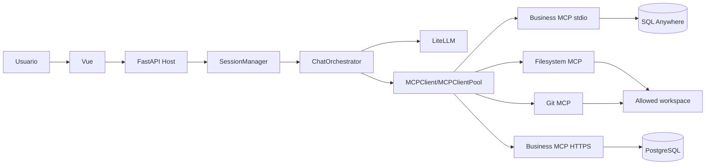

# Arquitectura implementada

## Componentes

1. Vue/Vite (`frontend/`) presenta sesiones, mensajes y visualizaciones.
2. FastAPI (`backend/api/app.py`) es el MCP Host y expone la API del chatbot.
3. `SessionManager` conserva el contexto en memoria por sesión.
4. `ChatOrchestrator` coordina LiteLLM y las llamadas a tools.
5. `MCPClient` implementa el cliente JSON-RPC/MCP manual.
6. `MCPClientPool` enruta tools entre el servidor empresarial y servidores
   oficiales Filesystem/Git.
7. El servidor empresarial local usa stdio y SQL Anywhere.
8. El servidor empresarial remoto usa HTTPS y PostgreSQL anonimizado.
9. `JSONRPCAuditLogger` registra ambos sentidos de la comunicación MCP.

## Flujo



## Configuración oficial

```env
MCP_OFFICIAL_SERVERS=filesystem,git
MCP_OFFICIAL_WORKSPACE=phase4_demo
```

Los runtimes externos requeridos son Node/npm para Filesystem y `uvx` para
Git. El workspace configurado es el límite de seguridad del servidor
Filesystem.

