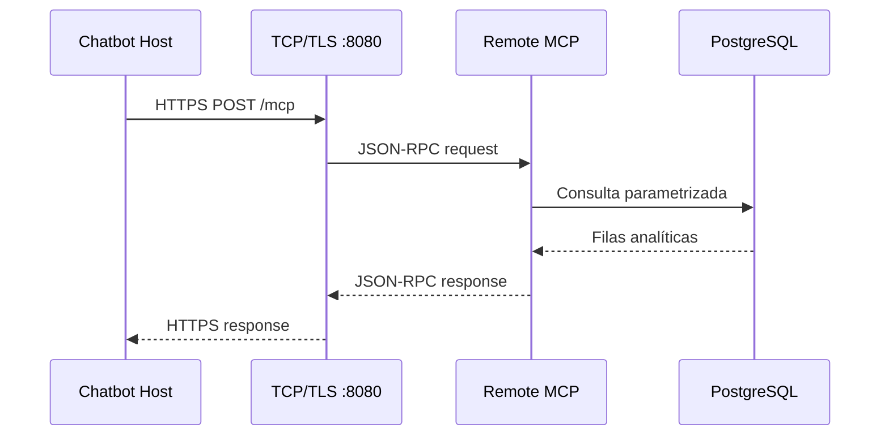

# Arquitectura de red

## Valores definidos por el proyecto

| Servicio | Transporte | Dirección/puerto |
|---|---|---|
| Frontend Vite | HTTP | `localhost:5173` |
| API FastAPI | HTTP/TCP | `127.0.0.1:8000` |
| MCP remoto | HTTPS/TCP | `:8080` |
| PostgreSQL Compose | PostgreSQL/TCP | `127.0.0.1:5432` |
| MCP local | stdin/stdout | No utiliza red |
| SQL Anywhere | ODBC/TCP | Variables `SQLANYWHERE_HOST` y `SQLANYWHERE_PORT` |

## Flujo remoto

IPv4/IPv6 y Ethernet/Wi-Fi dependen del equipo donde se ejecute y deben
obtenerse durante la demostración. El transporte stdio debe verificarse con
los logs JSONL, no con captura de red.

