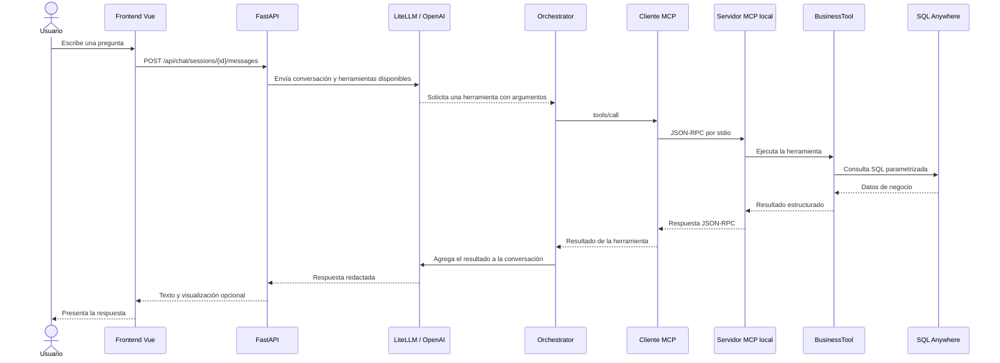
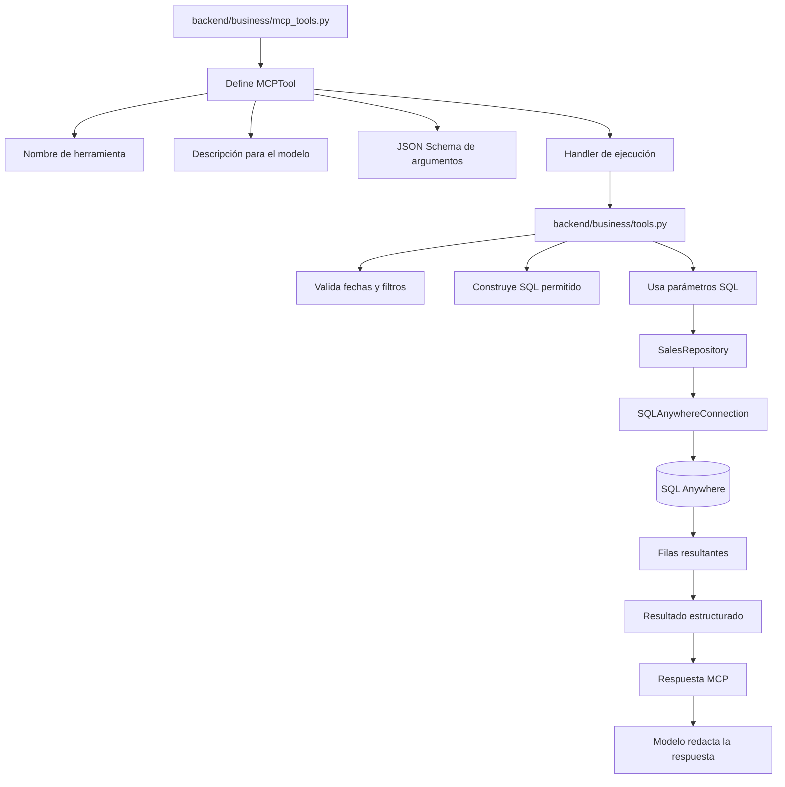

```mermaid
sequenceDiagram
    actor Usuario
    participant UI as Frontend Vue
    participant API as FastAPI
    participant LLM as LiteLLM / OpenAI
    participant ORQ as Orchestrator
    participant MCP_C as Cliente MCP
    participant MCP_S as Servidor MCP local
    participant TOOL as BusinessTool
    participant DB as SQL Anywhere

    Usuario->>UI: Escribe una pregunta
    UI->>API: POST /api/chat/sessions/{id}/messages
    API->>LLM: Envía conversación y herramientas disponibles
    LLM-->>ORQ: Solicita una herramienta con argumentos
    ORQ->>MCP_C: tools/call
    MCP_C->>MCP_S: JSON-RPC por stdio
    MCP_S->>TOOL: Ejecuta la herramienta
    TOOL->>DB: Consulta SQL parametrizada
    DB-->>TOOL: Datos de negocio
    TOOL-->>MCP_S: Resultado estructurado
    MCP_S-->>MCP_C: Respuesta JSON-RPC
    MCP_C-->>ORQ: Resultado de la herramienta
    ORQ->>LLM: Agrega el resultado a la conversación
    LLM-->>API: Respuesta redactada
    API-->>UI: Texto y visualización opcional
    UI-->>Usuario: Presenta la respuesta
```
## herramientas

```mermaid
flowchart TD
    A[backend/business/mcp_tools.py] --> B[Define MCPTool]
    B --> C[Nombre de herramienta]
    B --> D[Descripción para el modelo]
    B --> E[JSON Schema de argumentos]
    B --> F[Handler de ejecución]

    F --> G[backend/business/tools.py]
    G --> H[Valida fechas y filtros]
    G --> I[Construye SQL permitido]
    G --> J[Usa parámetros SQL]
    J --> K[SalesRepository]
    K --> L[SQLAnywhereConnection]
    L --> M[(SQL Anywhere)]

    M --> N[Filas resultantes]
    N --> O[Resultado estructurado]
    O --> P[Respuesta MCP]
    P --> Q[Modelo redacta la respuesta]
```