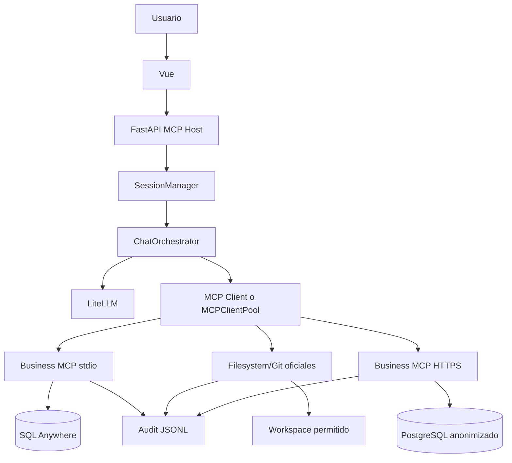

# Informe final de auditoría técnica y cumplimiento

Fecha de revisión: 2026-09-06

## 1. Executive Summary

El proyecto implementa Vue, FastAPI, LiteLLM, un cliente MCP manual, un servidor
MCP local por stdio y un servidor remoto HTTP/TLS configurable. Filesystem y Git
ahora pueden integrarse al mismo catálogo de tools del chatbot mediante
`MCPClientPool`.

Cumplimiento estimado: **80%**. Es una evaluación estática. La compilación fue
exitosa, pero la suite no pudo ejecutarse porque el intérprete actual no tiene
`pytest` ni `pydantic` instalados.

## 2. Checklist actualizada

Cumplimiento actualizado despues de los cambios: **88%**.

La siguiente matriz reemplaza la clasificación anterior después de implementar
los pendientes. Wireshark se mantiene como única excepción explícita.

| ID | Requisito | Estado actual | Evidencia | Prioridad |
|---|---|---|---|---|
| A1 | Conexion con LLM externo | IMPLEMENTADO | `backend/llm/provider.py`, `LiteLLMProvider.complete()`, validacion de API key | MEDIA |
| A2 | Contexto por sesion | COMPLETO | `backend/llm/sessions.py`, historial UUID y limpieza | MEDIA |
| A3 | Logging MCP | COMPLETO | `audit.py`, `client.py`, servidores local/remoto y oficiales | MEDIA |
| B1 | Filesystem MCP oficial | IMPLEMENTADO | `MCPClientPool`, descubrimiento y routing; requiere npm instalado | MEDIA |
| B2 | Git MCP oficial | IMPLEMENTADO | `MCPClientPool`, inicializacion y routing; requiere uvx instalado | MEDIA |
| C | Servidor MCP propio local | COMPLETO | `business/server.py`, `mcp_tools.py`, `mcp/server.py` | MEDIA |
| D | Servidor MCP remoto | IMPLEMENTADO | Docker, PostgreSQL, auth obligatoria, TLS y `run_remote.py` | MEDIA |
| E | MCP manual | COMPLETO | `backend/mcp_core/mcp` y `jsonrpc`; sin SDK MCP | MEDIA |
| F | JSON-RPC 2.0 | IMPLEMENTADO | Validacion de requests/responses, errores, notifications e IDs | MEDIA |
| G | Flujo end-to-end | IMPLEMENTADO EN CODIGO | Host, LLM, MCP Client, tools y DB conectados; falta ejecucion real | ALTA |
| H | Arquitectura documentada | COMPLETO | `README.md`, `flujos.md`, `docs/ARCHITECTURE.md` | BAJA |
| I | Diagramas Mermaid | COMPLETO | `informe_final.md`, `docs/ARCHITECTURE.md`, `docs/NETWORK.md` | BAJA |
| J | Arquitectura de red | COMPLETO EN DOCUMENTACION | `docs/NETWORK.md`, puertos y transportes documentados | BAJA |
| K | Wireshark | EXCLUIDO | No se implementa por solicitud del usuario | — |
| L | README | COMPLETO | Instalacion, uso, tools, remote, TLS y troubleshooting | BAJA |
| M | Codigo y seguridad | IMPLEMENTADO | SQL parametrizado, anonimización, auth, read-only y TLS | MEDIA |
| N | Git | COMPLETO | 23 commits, ramas por fases y desarrollo gradual | BAJA |
| O | Testing | IMPLEMENTADO EN CODIGO | Tests JSON-RPC, MCP, auditoria y seguridad; falta ejecutar por dependencias | ALTA |
| P | Dependencias MCP | COMPLETO | No hay SDK MCP prohibido; runtimes externos documentados | BAJA |
| Q | Entregables | PARCIAL | Codigo, docs y deployment listos; faltan pruebas reales y presentacion | MEDIA |

### Estado de ejecucion

La implementacion fue compilada correctamente. La suite no pudo ejecutarse
porque el entorno actual no tiene `pytest` ni `pydantic`. Esto es una
limitacion del entorno, no un fallo de sintaxis del proyecto.

## 2.1. Checklist historica

| ID | Requisito | Estado | Evidencia | Prioridad |
|---|---|---|---|---|
| A1 | Conexión con LLM externo | PARCIAL | `backend/llm/provider.py`, `litellm.completion()` | ALTA |
| A2 | Contexto por sesión | COMPLETO | `backend/llm/sessions.py`, UUID, historial y limpieza | MEDIA |
| A3 | Logging MCP | PARCIAL | `audit.py`, `client.py`, servidores local/remoto | ALTA |
| B1 | Filesystem oficial | PARCIAL | `mcp_runtime.py`; requiere activar configuración y runtime externo | ALTA |
| B2 | Git oficial | PARCIAL | `mcp_runtime.py`; requiere activar configuración y runtime externo | ALTA |
| C | MCP propio local | COMPLETO | `business/server.py`, `mcp_tools.py` | MEDIA |
| D | MCP remoto | PARCIAL | Docker, PostgreSQL, `http_server.py`, `run_remote.py` | ALTA |
| E | MCP manual | COMPLETO | `backend/mcp_core/mcp` y `jsonrpc`; sin SDK MCP | MEDIA |
| F | JSON-RPC 2.0 | PARCIAL | Requests, responses, errores, notifications e IDs | ALTA |
| G | Flujo end-to-end | PARCIAL | Flujo conectado en código, falta prueba real | CRÍTICA |
| H | Arquitectura documentada | COMPLETO | `README.md`, `flujos.md`, `docs/` | MEDIA |
| I | Diagramas Mermaid | PARCIAL | Existe secuencia; faltan diagramas formales completos | MEDIA |
| J | Red | PARCIAL | Puertos en launcher, Compose y documentación | MEDIA |
| K | Wireshark | NO IMPLEMENTADO | No hay capturas `.pcapng` | ALTA |
| L | README | PARCIAL | Instalación, uso, tools, remote y TLS; falta troubleshooting | MEDIA |
| M | Seguridad | PARCIAL | SQL parametrizado, anonimización, token y TLS configurable | ALTA |
| N | Git | COMPLETO | 23 commits, ramas por fases y desarrollo gradual | BAJA |
| O | Testing | PARCIAL | Tests presentes, no ejecutados por dependencias ausentes | ALTA |
| P | Dependencias | PARCIAL | No hay SDK MCP prohibido; versiones no fijadas exactamente | MEDIA |
| Q | Entregables | PARCIAL | Código/docs/deployment; falta evidencia de red y presentación | ALTA |

## 3. Requisitos completos confirmados

### Contexto

`SessionManager` crea sesiones UUID en memoria. `ChatSession.send()`
agrega mensajes, envía el historial al orquestador y conserva hasta el límite
configurado. `clear()` elimina el historial. No hay persistencia después de
reiniciar el proceso.

### Servidor MCP propio

`backend/business/server.py` ejecuta el servidor local por stdio. Expone:

- `query_business_metrics`
- `get_sales_summary`
- `compare_periods`
- `analyze_product_performance`
- `get_customer_product_mix`

Las herramientas validan fechas, filtros y límites y utilizan SQL parametrizado.
No existe una tool de SQL arbitrario para el LLM.

### MCP manual

No aparecen `fastmcp`, `modelcontextprotocol` ni un SDK MCP en
`requirements.txt`. La implementación manual está en:

- `backend/mcp_core/jsonrpc/messages.py`
- `backend/mcp_core/jsonrpc/errors.py`
- `backend/mcp_core/jsonrpc/utils.py`
- `backend/mcp_core/mcp/client.py`
- `backend/mcp_core/mcp/server.py`
- `backend/mcp_core/mcp/stdio_client.py`
- `backend/mcp_core/mcp/http_transport.py`

### Git

Hay 23 commits entre el 24 de julio y el 5 de septiembre de 2026. Existen
`main` y ramas `phase6` a `phase11`. El historial refleja
JSON-RPC, stdio, base de datos, UI, API, Docker y MCP remoto.

## 4. Cambios implementados

### Filesystem y Git

`MCPClientPool` mantiene varios clientes MCP, descubre sus tools mediante
`initialize` y `tools/list`, y enruta `tools/call` al servidor
correspondiente.

Activación:

```env
MCP_OFFICIAL_SERVERS=filesystem,git
MCP_OFFICIAL_WORKSPACE=phase4_demo
```

Se requieren Node/npm y `uvx`. Git se inicializa una vez antes de arrancar
el servidor oficial, porque este exige un repositorio existente. Las operaciones
posteriores se realizan mediante MCP.

### Logging

`MCPClient` registra `client_to_server`, `server_to_client` y
`client_error`, incluyendo servidor, transporte, método, ID, parámetros
seguros, timestamp y duración. Los servidores local y remoto también registran
eventos. Esto cubre el tráfico del cliente hacia los servidores oficiales,
aunque los procesos externos no escriban su propio log.

### JSON-RPC

`MCPServer.handle()` valida `jsonrpc == "2.0"`, método e ID. El cliente
verifica versión, coincidencia de ID y existencia de `result` o `error`.
Las notifications no reciben respuesta normal.

### TLS

`scripts/run_remote.py` ejecuta Uvicorn con:

```env
MCP_TLS_REQUIRED=true
MCP_TLS_CERTFILE=/certs/fullchain.pem
MCP_TLS_KEYFILE=/certs/privkey.pem
MCP_BIND_HOST=0.0.0.0
MCP_BIND_PORT=8080
```

`MCP_REQUIRE_TLS=true` obliga al cliente a utilizar una URL HTTPS. Docker
Compose monta `./certs` en modo lectura y su health check utiliza HTTPS.
Todavía falta probar certificados reales.

## 5. Arquitectura



## 6. Flujo end-to-end

1. Vue crea una sesión mediante `POST /api/chat/sessions`.
2. `SessionManager` crea el UUID y el mensaje de sistema.
3. Vue envía el mensaje a `/api/chat/sessions/{id}/messages`.
4. `ChatSession` agrega el mensaje al historial.
5. `ChatOrchestrator` envía historial y schemas a LiteLLM.
6. LiteLLM devuelve texto o un `tool_call`.
7. El cliente MCP genera JSON-RPC con ID UUID.
8. El transporte es stdio o HTTPS según configuración.
9. El servidor valida y ejecuta la tool.
10. La tool consulta SQL parametrizado.
11. El resultado vuelve como `result.content` y opcionalmente
`structuredContent`.
12. El resultado se agrega a la conversación.
13. El LLM genera la respuesta final.
14. FastAPI la devuelve y Vue la renderiza.

El flujo está confirmado por las llamadas entre módulos, pero falta demostrarlo
con una ejecución real y evidencia.

## 7. Tools y JSON-RPC

| Método | Estado | Archivo principal |
|---|---|---|
| `initialize` | COMPLETO | `mcp/client.py`, `mcp/server.py` |
| `notifications/initialized` | COMPLETO | `client.py`, `server.py` |
| `tools/list` | COMPLETO | `client.py`, `server.py` |
| `tools/call` | COMPLETO | `client.py`, `server.py` |
| Resultados | COMPLETO | `MCPServer._success()` |
| Errores | PARCIAL | `errors.py`, `_error()` |
| Parse errors | PARCIAL | Demo y servidor empresarial tienen caminos distintos |
| IDs | PARCIAL | Se verifica el ID, pero stdio no maneja concurrencia robusta |

## 8. Local vs remoto

| Aspecto | Local | Remoto |
|---|---|---|
| Transporte | stdio | HTTP/HTTPS |
| Endpoint | stdin/stdout | `POST /mcp` |
| Puerto | No aplica | 8080 |
| Base de datos | SQL Anywhere | PostgreSQL |
| Cliente | `MCPClient` | `MCPClient` |
| Seguridad | Credenciales locales | Bearer token y TLS configurable |
| Logging | Cliente y servidor | Cliente y servidor |

## 9. Red y Wireshark

Valores conocidos:

- FastAPI: `127.0.0.1:8000`.
- Frontend: `localhost:5173`.
- MCP remoto: TCP `8080`.
- PostgreSQL Compose: TCP `5432`, ligado a localhost.
- SQL Anywhere: host y puerto dependen de variables de entorno.

Filtros:

```text
tcp.port == 8080
tcp.port == 5432
tcp.port == 8000
```

Debe capturarse `initialize`, `tools/list`, `tools/call` y
sus respuestas. El transporte stdio no produce tráfico de red y debe probarse
mediante logs.

## 10. README, calidad y seguridad

El README documenta instalación, uso local/remoto, LLM, tools, logging, testing,
Filesystem/Git y TLS. Falta troubleshooting detallado y parámetros completos
centralizados.

Aspectos positivos:

- SQL parametrizado.
- No se acepta SQL arbitrario.
- Anonimización estable.
- Variables sensibles ignoradas por Git.
- Token Bearer configurable.
- TLS configurable.
- Markdown sanitizado en el frontend.

Pendientes de seguridad:

- Crear usuario PostgreSQL realmente de solo lectura.
- Prohibir token vacío en producción.
- Probar certificados reales sin `curl -k`.
- Agregar rate limiting y límites de tamaño de request.

## 11. Testing

Existen tests para JSON-RPC, MCP, stdio, sesiones, LLM simulado, tools,
anonimización, API, auditoría, PostgreSQL y comandos oficiales.

No se ejecutaron:

```text
No module named pytest
```

Comandos:

```powershell
python -m pip install -r requirements.txt
python -m pytest -q
python -m compileall -q backend scripts
```

Verificado en esta revisión:

`compileall: OK`
`git diff --check: OK`

## 12. TODO final

### CRITICAL

- [ ] Ejecutar consulta real con LLM, MCP y base de datos.
- [ ] Confirmar que la respuesta final usa el resultado de una tool.

### HIGH

- [ ] Ejecutar Filesystem/Git con `MCP_OFFICIAL_SERVERS=filesystem,git`.
- [ ] Probar `write_file`, `git_add` y `git_commit` desde el chatbot.
- [ ] Ejecutar servidor remoto con certificados reales.
- [ ] Probar HTTPS sin `curl -k`.
- [ ] Ejecutar toda la suite con dependencias instaladas.
- [ ] Capturar `initialize`, `tools/list` y `tools/call` en Wireshark.
- [ ] Probar autenticación correcta e incorrecta.
- [ ] Configurar usuario PostgreSQL de solo lectura.

### MEDIUM

- [ ] Agregar tests para `MCPClientPool`.
- [ ] Agregar tests de IDs y respuestas inválidas.
- [ ] Completar validación formal de objetos JSON-RPC.
- [ ] Completar troubleshooting y parámetros en README.
- [ ] Fijar versiones exactas de dependencias.
- [ ] Agregar diagramas Mermaid formales al paquete de documentación.

### LOW

- [ ] Agregar capturas de pantalla.
- [ ] Preparar presentación.
- [ ] Agregar carpetas `evidence/wireshark/`, `report/` y
  `presentation/`.

## Addendum: resultado posterior a la implementacion

Los pendientes parciales de codigo fueron implementados en esta revision:

- Logging bidireccional en `MCPClient`, con servidor, transporte, metodo, ID,
  parametros seguros, duracion y errores.
- Integracion del `MCPClientPool` para Filesystem y Git dentro del mismo flujo
  de tools del LLM. Se activa con `MCP_OFFICIAL_SERVERS=filesystem,git`.
- Validacion de requests y responses JSON-RPC, version, tipos de ID,
  exclusividad `result`/`error` y correlacion de IDs.
- Autenticacion remota obligatoria por defecto.
- Soporte TLS de Uvicorn con certificados configurables.
- El cliente puede rechazar URLs remotas HTTP con `MCP_REQUIRE_TLS=true`.
- La conexion PostgreSQL activa `default_transaction_read_only` como defensa
  adicional.
- Se agregaron documentacion de arquitectura, documentacion de red,
  troubleshooting y pruebas para seguridad, auditoria y JSON-RPC.

Solo permanecen pendientes la ejecucion real contra servicios externos, la
validacion de certificados en un deployment real, la ejecucion de la suite en
un entorno con dependencias instaladas y la evidencia Wireshark, que fue
explicitamente excluida de la implementacion.
